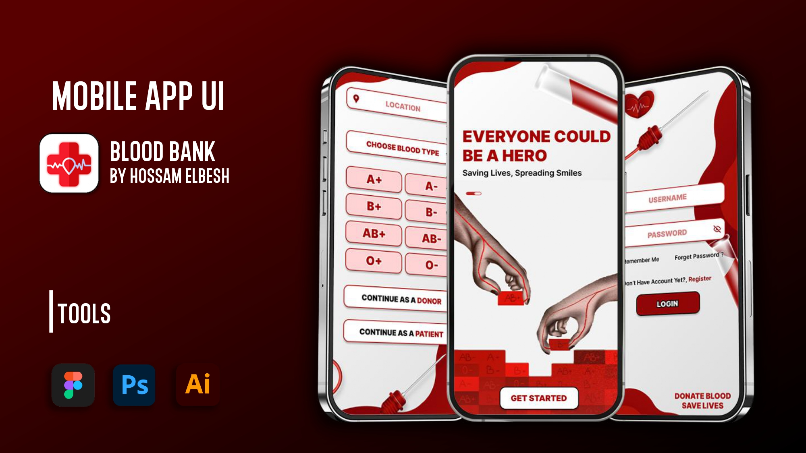

# Blood Bank Management System

## Overview
The **Blood Bank Management System** is a project designed to manage blood donation, storage, and distribution efficiently. It provides functionalities for donors, patients, staff, and administrators, ensuring smooth coordination and transparency.

## User Stories
- **Donors**: Register, schedule appointments, track donation history, and receive notifications for upcoming opportunities.
- **Patients**: Search for blood by type and location, request blood, and track request status in real-time.
- **Staff**: Manage blood inventory, process donor and patient requests, and generate reports for analysis.
- **System**: Maintain user and inventory records, integrate with external blood banks, and ensure secure data handling.

## Features
- Simplified donation scheduling for donors.
- Real-time search and blood request functionality for patients.
- Inventory management and notifications for staff.
- Integration with external blood banks for better availability.

## Resources
- [User Stories & Requirements](Documentation.pdf)
- [Activity Diagram](Activity%20Diagram/Blood%20Bank%20ActivityDiagram.jpg)
- [Wireframe Design](Design/WireFrame.pdf)
- [UI Design](Design/UI.pdf)
